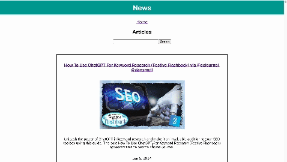

# News

## Abstract

Application uses an API to fetch news article data. The user can view a snippet of the article on the home page and click the title for mor details. They will navigated to a page that includes mor information including the link to the full article

### Application link:

[https://github.com/zenmcmillan/News](https://github.com/zenmcmillan/News)

### Preview of App:

### Installations Instructions:

1. In your terminal run git clone `git@github.com:zenmcmillan/News.git`
2. Run cd `news`
3. Run `npm install`. It will take a few seconds to finish
4. Run `npm start` and you should see the application in the browser

### Wins & Challenges

- This was my first time creating a search component so that was challenging. I struggled with resetting the state to what it originally was at the beginining of each search. I was able to fix this problem by creating another state for the original articles.

